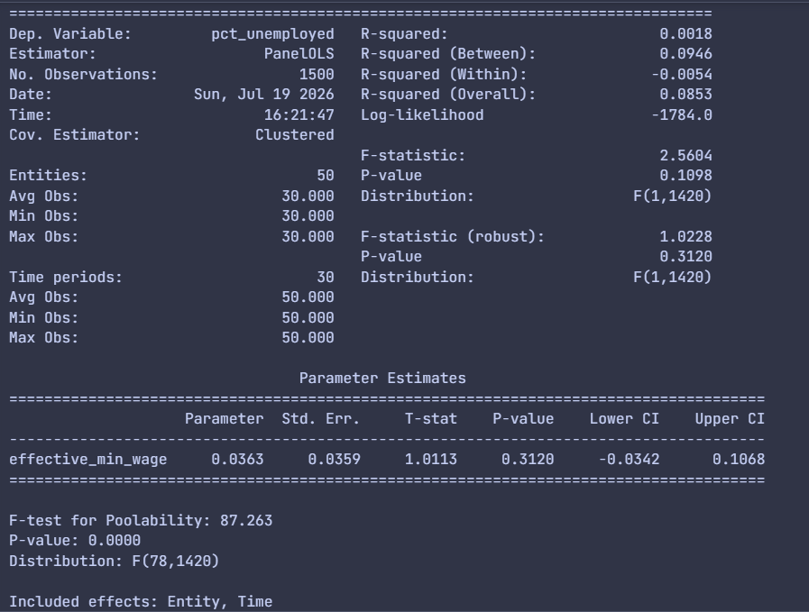

# Minimum Wage Policy in the United States: A State-Level Panel Analysis (1995-2024)

**Research question:** Do U.S. states that raise their minimum wage above the federal floor
experience measurably different outcomes in unemployment, poverty, and median household
income, once state and year fixed effects are controlled for?

Framed as a policy brief for a media-client audience, connecting the empirical evidence to
the active Raise the Wage Act, which proposes a $17 federal minimum wage.


## Skills Demonstrated

`Python` `pandas` `NumPy` `matplotlib` `seaborn` `linearmodels` `FRED API`
`Git` `Jupyter`

- API-based data acquisition and panel construction from a public government source
- Diagnosing and resolving a real data production gap (Census SAIPE), not a synthetic one
- Causal inference methodology: two-way fixed effects, clustered standard errors
- Statistical inference and honest reporting of null results
- Data visualization for a non-technical audience
- Reproducible, documented analytical pipeline

## Key Results

- **Unemployment:** no statistically significant relationship with minimum wage.
- **Poverty rate:** no statistically significant relationship with minimum wage.
- **Median household income:** a statistically significant positive relationship,
  read as associative rather than causal.
- Based on 1,500 observations across 50 U.S. states, 1995-2024.

| Outcome           | Coefficient | P-value | 95% CI            | Result                |
| ----------------- | ----------- | ------- | ----------------- | --------------------- |
| Unemployment (%)  | 0.036       | 0.312   | -0.034 to 0.107   | Not significant       |
| Poverty rate (%)  | 0.025       | 0.690   | -0.099 to 0.150   | Not significant       |
| Median income ($) | 1265.50     | 0.0001  | 635.53 to 1895.50 | Significant, positive |

Full findings, framing, and limitations in `output/Minimum_Wage_Policy_Brief.pdf`, which
includes a References section citing all literature referenced above (Card & Krueger, NBER,
Peterson Institute, Upjohn Institute, and primary government sources).

## Pipeline

```
FRED API
   |
   v
fetch_fred.py            (Stage 1: acquisition)
   |
   v
Raw CSVs (data/raw/)
   |
   v
01__cleaning.ipynb        (Stage 2-3: clean, annualize, merge)
   |
   v
state_panel_1995_2024.csv (data/processed/)
   |
   v
02_eda.ipynb               (Stage 4: exploratory analysis)
   |
   v
03_modeling.ipynb           (Stage 5: fixed-effects regressions)
   |
   v
Policy Brief + Figures      (output/, figures/)
```

## Data

All four variables are sourced from the [FRED API](https://fred.stlouisfed.org/docs/api/fred/):

| Variable                | Source series pattern         | Frequency | Native range |
| ----------------------- | ----------------------------- | --------- | ------------ |
| Unemployment rate       | `{STATE}UR`                 | Monthly   | 1976-present |
| State minimum wage      | `STTMINWG{STATE}`           | Annual    | 1968-present |
| Median household income | `MEHOINUS{STATE}A646N`      | Annual    | 1984-2024    |
| Poverty rate            | `PPAA{STATE}{FIPS}A156NCEN` | Annual    | 1989-2024    |

**Panel window: 1995-2024**, narrower than several series' native range. The Census SAIPE
program (poverty) has documented gaps in 1990-1992 and 1994, plus isolated, disconnected
estimates for 1989 and 1993. Rather than keep an unbalanced panel around those two isolated
points, the panel starts in 1995, where all four variables are fully continuous through 2024.
Full reasoning in `data/DATA_NOTES.md`.

Final panel: 50 states x 30 years = 1,500 state-year observations, no missing values, no
duplicate keys.

## Method

Panel regression with state and year fixed effects (`linearmodels.PanelOLS`), clustered
standard errors by state. Three separate regressions, one per outcome (unemployment,
poverty, income), same independent variable (effective minimum wage, defined as the higher
of the state and federal rate for that year).

## Figures




## Repo Structure

```
|-- data/
|   |-- raw/                    # untouched FRED pulls, one CSV per variable
|   |-- processed/              # cleaned, merged state-year panel
|   `-- DATA_NOTES.md           # every cleaning/scoping decision, with reasoning
|-- src/
|   `-- fetch_fred.py           # Stage 1: data acquisition
|-- notebooks/
|   |-- 01__cleaning.ipynb      # Stage 2-3: clean, annualize, merge into panel
|   |-- 02_eda.ipynb            # Stage 4: exploratory analysis
|   `-- 03_modeling.ipynb       # Stage 5: fixed-effects regressions
|-- figures/                    # exported chart PNGs
`-- output/
    `-- Minimum_Wage_Policy_Brief.pdf
```

## Reproducing

```bash
pip install -r requirements.txt
export FRED_API_KEY="your_key_here"

python src/fetch_fred.py                 # Stage 1: pulls raw data into data/raw/
# then run, in order:
# notebooks/01__cleaning.ipynb           # Stage 2-3: outputs data/processed/state_panel_1995_2024.csv
# notebooks/02_eda.ipynb                 # Stage 4: outputs figures/*.png
# notebooks/03_modeling.ipynb            # Stage 5: fixed-effects regressions
```

## Limitations

See the Limitations section of the policy brief (`output/Minimum_Wage_Policy_Brief.pdf`)
for a full discussion of what this analysis can and cannot conclude.
