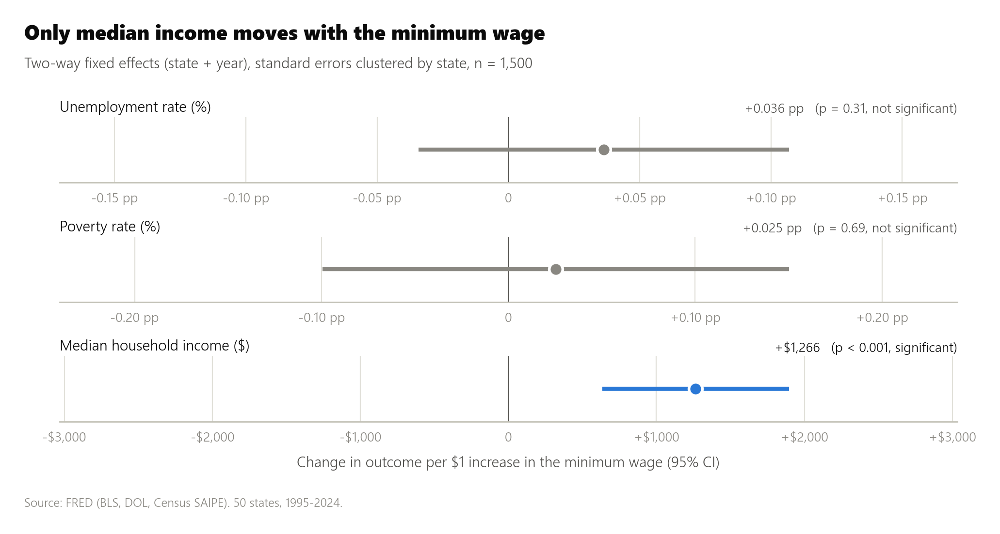
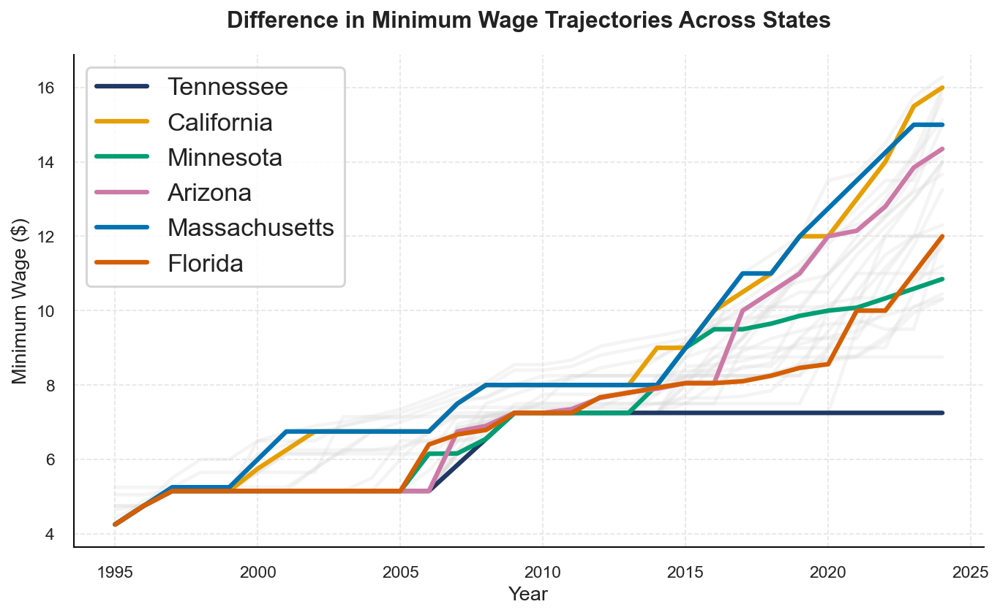
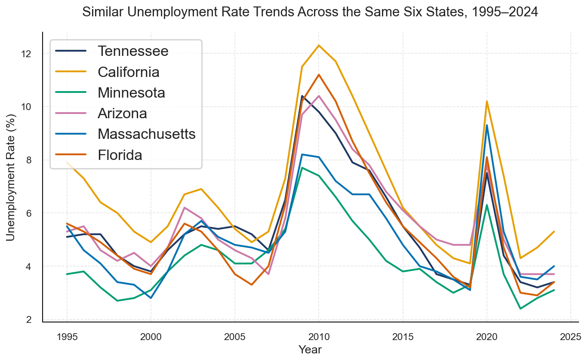
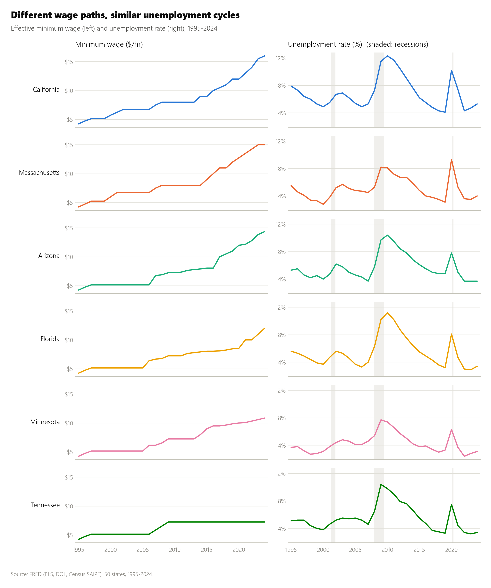
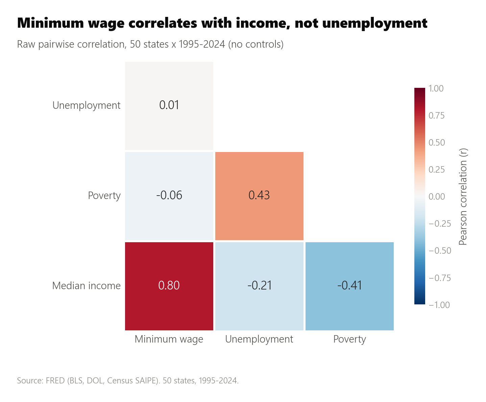
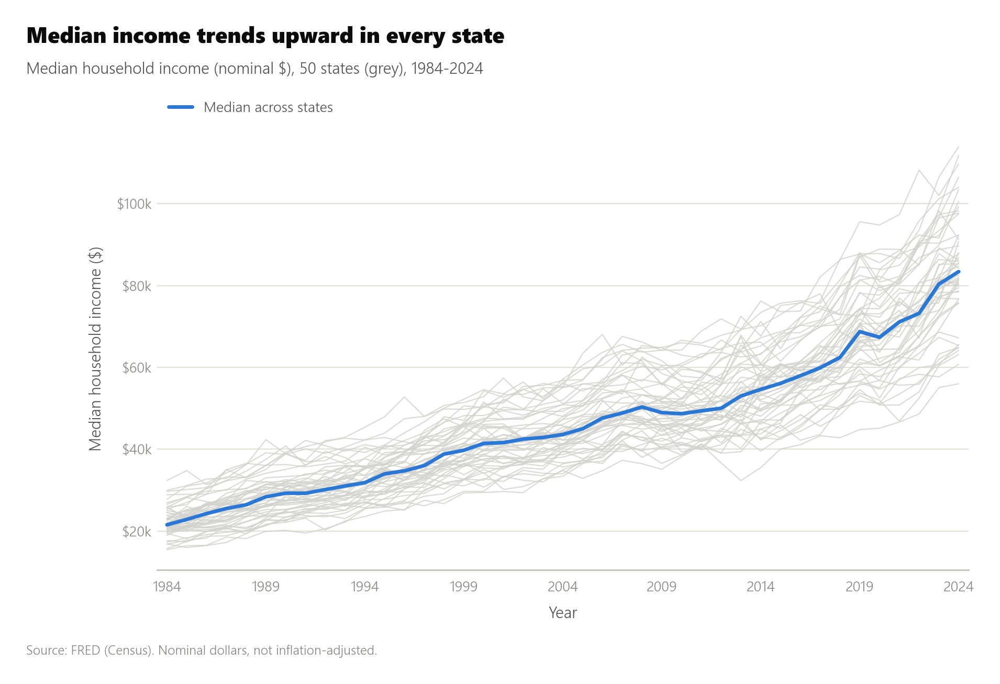
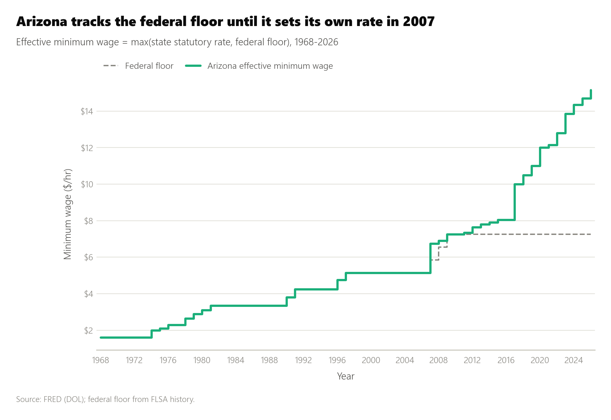

# Minimum Wage Policy in the United States: A State-Level Panel Analysis (1995-2024)

`Python` `pandas` `NumPy` `matplotlib` `seaborn` `linearmodels` `FRED API` `Git` `Jupyter`

> **Bottom line:** Across 50 states and 30 years, raising the minimum wage shows **no measurable
> effect on unemployment or poverty**, and a **significant positive association with median
> household income** (+$1,266 per $1 increase), once state and year fixed effects are controlled for.

| | |
| --- | --- |
| **Question** | Do states that raise their minimum wage above the federal floor see different unemployment, poverty, and income outcomes? |
| **Data** | 1,500 state-year observations (50 states x 1995-2024), pulled from the FRED API |
| **Method** | Two-way fixed-effects panel regression (state + year), standard errors clustered by state |
| **Audience** | Policy brief for a media client, tied to the proposed Raise the Wage Act, which would raise the federal minimum wage to $17 |
| **Deliverable** | [Policy brief (PDF)](output/Minimum_Wage_Policy_Brief.pdf) · [Word](output/Minimum_Wage_Policy_Brief.docx) · [Cleaning](notebooks/01_cleaning.ipynb) · [EDA](notebooks/02_eda.ipynb) · [Modeling](notebooks/03_modeling.ipynb) |

---

## Key Results



| Outcome           | Coefficient | P-value | 95% CI            | Result                |
| ----------------- | ----------- | ------- | ----------------- | --------------------- |
| Unemployment (%)  | 0.036       | 0.312   | -0.034 to 0.107   | Not significant       |
| Poverty rate (%)  | 0.025       | 0.690   | -0.099 to 0.150   | Not significant       |
| Median income ($) | 1265.50     | 0.0001  | 635.53 to 1895.50 | Significant, positive |

- **Unemployment:** no statistically significant relationship with minimum wage.
- **Poverty rate:** no statistically significant relationship with minimum wage.
- **Median household income:** a statistically significant positive relationship,
  read as associative rather than causal.

Full findings, framing, and limitations in the [policy brief](output/Minimum_Wage_Policy_Brief.pdf), which
includes a References section citing all literature referenced (Card & Krueger, NBER,
Peterson Institute, Upjohn Institute, and primary government sources).

---

## The Story in Charts

**1. State policies have diverged sharply.** By 2024 the six focus states span nearly the full
national range, from Tennessee at the $7.25 federal floor to California at $16.



**2. Unemployment did not diverge with them.** Six different wage paths, one shared
unemployment story: every state spikes in the same recessions, at the same time.



**3. State by state, side by side.** Wage policy (left) against unemployment (right) for each
focus state, on shared axes.



**4. The raw correlations point the same way, with one caveat.** Minimum wage is uncorrelated
with unemployment (r = 0.01) and poverty (r = -0.06) but strongly correlated with income
(r = 0.80). That income link likely reflects high-wage states also being wealthier, which is
why the regressions add state and year fixed effects.



---

## Skills Demonstrated

- API-based data acquisition and panel construction from a public government source
- Diagnosing and resolving a real data production gap (Census SAIPE), not a synthetic one
- Causal inference methodology: two-way fixed effects, clustered standard errors
- Statistical inference and honest reporting of null results
- Data visualization for a non-technical audience, with a shared chart style ([`src/style.py`](src/style.py))
- Reproducible, documented analytical pipeline

---

## Data

All four variables are sourced from the [FRED API](https://fred.stlouisfed.org/docs/api/fred/):

| Variable                | Source series pattern       | Frequency | Native range |
| ----------------------- | --------------------------- | --------- | ------------ |
| Unemployment rate       | `{STATE}UR`                 | Monthly   | 1976-present |
| State minimum wage      | `STTMINWG{STATE}`           | Annual    | 1968-present |
| Median household income | `MEHOINUS{STATE}A646N`      | Annual    | 1984-2024    |
| Poverty rate            | `PPAA{STATE}{FIPS}A156NCEN` | Annual    | 1989-2024    |

**Panel window: 1995-2024**, narrower than several series' native range. The Census SAIPE
program (poverty) has documented gaps in 1990-1992 and 1994, plus isolated, disconnected
estimates for 1989 and 1993. Rather than keep an unbalanced panel around those two isolated
points, the panel starts in 1995, where all four variables are fully continuous through 2024.
Full reasoning in [`data/DATA_NOTES.md`](data/DATA_NOTES.md).

Final panel: 50 states x 30 years = 1,500 state-year observations, no missing values, no
duplicate keys.

**Cleaning checks.** The *effective* minimum wage is the higher of the state and federal rate
for each year. The Arizona spot check (right) confirms the logic: Arizona sits on the federal
floor until it sets its own rate in 2007.

<table>
  <tr>
    <td width="50%"></td>
    <td width="50%"></td>
  </tr>
</table>

---

## Method

Panel regression with state and year fixed effects (`linearmodels.PanelOLS`), clustered
standard errors by state. Three separate regressions, one per outcome (unemployment,
poverty, income), same independent variable (effective minimum wage, defined as the higher
of the state and federal rate for that year).

$$y_{st} = \beta \cdot \text{MinWage}_{st} + \alpha_s + \gamma_t + \varepsilon_{st}$$

State fixed effects ($\alpha_s$) absorb anything constant within a state (industry mix, cost
of living); year fixed effects ($\gamma_t$) absorb national shocks that hit every state at once
(recessions, federal policy).

---

## Pipeline

```
FRED API
   |
   v
fetch_fred.py              (acquisition)
   |
   v
Raw CSVs (data/raw/)
   |
   v
01_cleaning.ipynb          (clean, annualize, merge)
   |
   v
state_panel_1995_2024.csv  (data/processed/)
   |
   v
02_eda.ipynb               (exploratory analysis)
   |
   v
03_modeling.ipynb          (fixed-effects regressions)
   |
   v
Policy Brief + Figures     (output/, figures/)
```

## Repo Structure

```
|-- data/
|   |-- raw/                    # untouched FRED pulls, one CSV per variable
|   |-- processed/              # cleaned, merged state-year panel
|   `-- DATA_NOTES.md           # every cleaning/scoping decision, with reasoning
|-- src/
|   |-- fetch_fred.py           # data acquisition
|   `-- style.py                # shared chart theme, colors, labels, figure export
|-- notebooks/
|   |-- 01_cleaning.ipynb       # clean, annualize, merge into panel
|   |-- 02_eda.ipynb            # exploratory analysis
|   `-- 03_modeling.ipynb       # fixed-effects regressions
|-- figures/                    # exported chart PNGs (see table below)
`-- output/
    `-- Minimum_Wage_Policy_Brief.pdf
```

| Figure | Produced by |
| --- | --- |
| `01_min_wage_trajectory.png`, `02_unemployment_overlay.png`, `03_correlation_heatmap.png`, `05_state_small_multiples.png` | `02_eda.ipynb` |
| `04_regression_results.png` | `03_modeling.ipynb` |
| `06_median_income_all_states.png`, `07_arizona_effective_wage_check.png` | `01_cleaning.ipynb` |

## Reproducing

```bash
pip install -r requirements.txt
export FRED_API_KEY="your_key_here"

python src/fetch_fred.py                 # Stage 1: pulls raw data into data/raw/
# then run, in order:
# notebooks/01_cleaning.ipynb            # Stage 2-3: outputs data/processed/state_panel_1995_2024.csv
# notebooks/02_eda.ipynb                 # Stage 4: exploratory charts
# notebooks/03_modeling.ipynb            # Stage 5: fixed-effects regressions + results chart
```

## Limitations

See the Limitations section of the [policy brief](output/Minimum_Wage_Policy_Brief.pdf)
for a full discussion of what this analysis can and cannot conclude.
